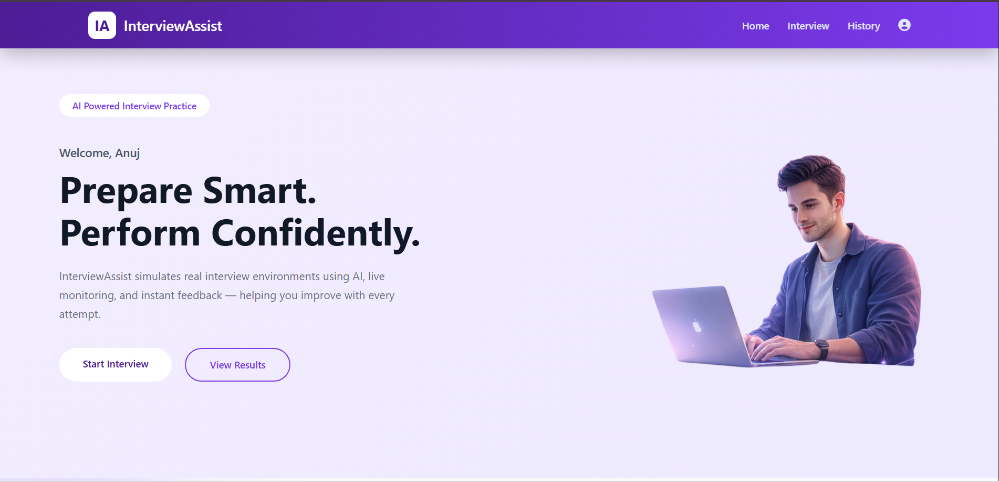
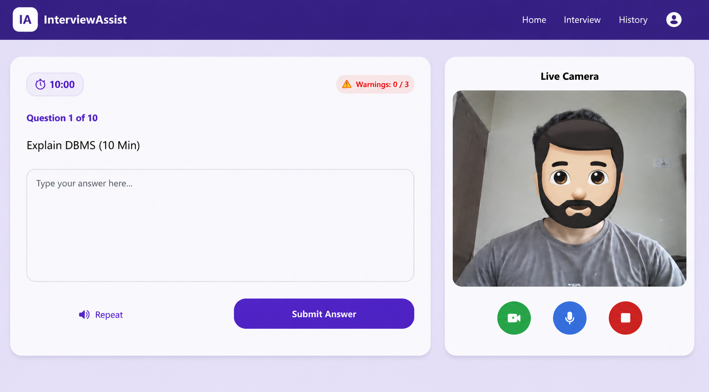
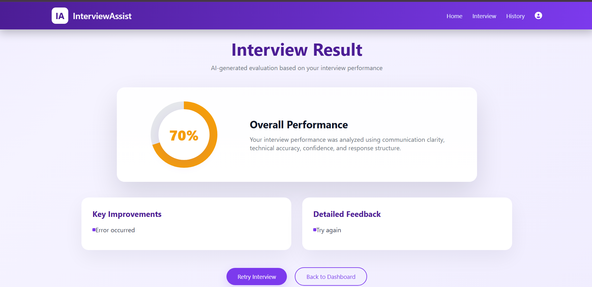
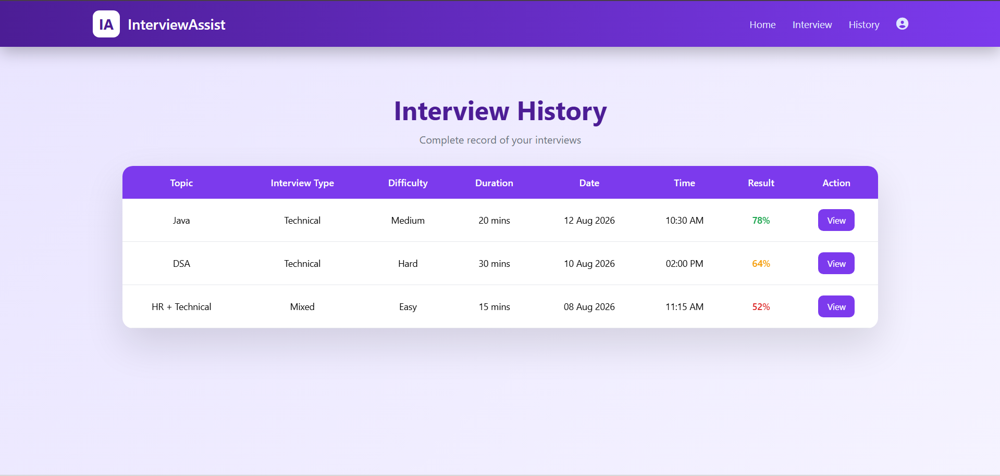

# 🎤 Interview Assist AI

An AI-powered web application that simulates real technical interviews, helping students practice, improve communication skills, and prepare confidently for campus placements and software engineering interviews.

The platform generates interview questions, records interview history, and provides an interactive interview experience with a clean, responsive interface.

---

## 📸 Application Screenshots

### 🏠 Home Page



### ⚙️ Interview Setup


### 🎤 Live AI Interview



### 📊 Interview Result



### 📜 Interview History



---

## ✨ Features

- 🤖 AI-powered technical interview question generation
- 🎤 Interactive interview simulation
- ⏱️ Timer-based interview sessions
- 🎥 Live camera monitoring interface
- 🎙️ Voice answer support
- 🔐 Secure User Authentication (Login & Registration)
- 📈 Interview history tracking
- 📊 AI-generated interview result dashboard
- 📱 Fully responsive UI
- 🧩 Modular MVC architecture
- 🔒 Secure API integration using environment variables

---

## 🛠️ Tech Stack

### Frontend

- HTML5
- CSS3
- JavaScript

### Backend

- Node.js
- Express.js

### Database

- MongoDB

### Architecture & Tools

- MVC Architecture
- REST API
- Git
- GitHub
- dotenv

---

## 📂 Project Structure

```text
InterviewAssist/
│
├── controllers/
├── models/
├── routes/
├── views/
├── config/
├── ai/
├── public/
├── screenshots/
├── server.js
├── package.json
└── README.md
```

---

## 🚀 Getting Started

### Clone Repository

```bash
git clone https://github.com/anuj-121/InterviewAssist.git
```

### Install Dependencies

```bash
npm install
```

### Configure Environment Variables

Create a `.env` file in the project root.

```env
PORT=5000
MONGODB_URI=your_mongodb_connection_string
API_KEY=your_api_key
```

### Run Project

```bash
node server.js
```

Open:

```
http://localhost:5000
```

---

## 🚀 Current Features

- AI Interview Question Generation
- Live Interview Interface
- Camera Monitoring
- Voice-Based Answer Practice
- Interview Result Dashboard
- Interview History
- Responsive Design
- Secure Authentication
- REST API Integration

---

## 🔮 Planned Features

- AI Answer Evaluation & Feedback
- Resume-Based Interview Questions
- Performance Analytics Dashboard
- Company-Specific Interview Mode
- Java Interview Mode
- Web Development Interview Mode
- Database Interview Mode
- Aptitude Interview Mode
- HR Interview Mode
- Mock Interview Reports
- PDF Report Download
- Cloud Deployment

---

## 🌐 Live Demo

🚧 Deployment in Progress

---

## 🤝 Contributing

Contributions, feature suggestions, and improvements are welcome.

1. Fork the repository
2. Create a feature branch
3. Commit your changes
4. Open a Pull Request

---

## 👨‍💻 Developer

**Anuj Shinde**

B.Tech Computer Science & Engineering

💼 Aspiring Software Developer | AI & Web Development Enthusiast

- 🔗 LinkedIn: https://www.linkedin.com/in/anuj-shinde-b78378274
- 💻 GitHub: https://github.com/anuj-121

---

## ⭐ Support

If you found this project useful, consider giving it a ⭐ on GitHub.
